<p align="center">
  
</p>

---

## About

Does this sound familiar? You find a pretty plant at the supermarket, buy it, and promise yourself you'll take good care of it. Then life gets busy, the days blur together, and before you know it, your plant has withered from neglect.

I wanted to make a change. With GreenKeeper, you get a desktop app that helps you keep track of your plants' care schedules, from watering and fertilizing to sunlight needs, so nothing falls through the cracks again.

## Overview

<p align="center">
  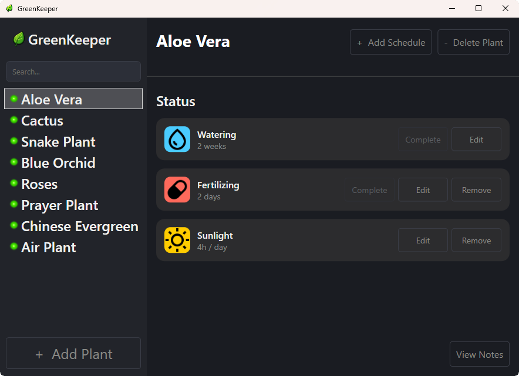
</p>

The interface is split into the following areas:

- **Sidebar** (left) - search your plants and select one to view its details.
  Each plant shows a colored status dot, so you can spot what needs attention at glance.
- **Header** (top right) - add a new care schedule or delete the selected plant.
- **Status area** - see and manage the selected plant's care schedules
  (watering, fertilizing, sunlight), complete, edit, or remove them, and
  open its notes

## Built With

| Technology | Used for |
|---|---|
| **C# / .NET 9** | Core application language and runtime |
| **WPF** (Windows Presentation Foundation) | Desktop UI, custom-styled controls, data binding and MVVM |
| **Entity Framework Core** | Local data persistence - used to store the plants and its data in a database |
| **SQLite** | The actual database that stores the plants and their care schedules as well as their sunlight requirement |
| **xUnit** | Unit testing of the application |

## How to Use

### Adding a Plant

Getting started is simple: click **+ Add Plant** in the bottom left corner
of the sidebar.

<p align="center">
  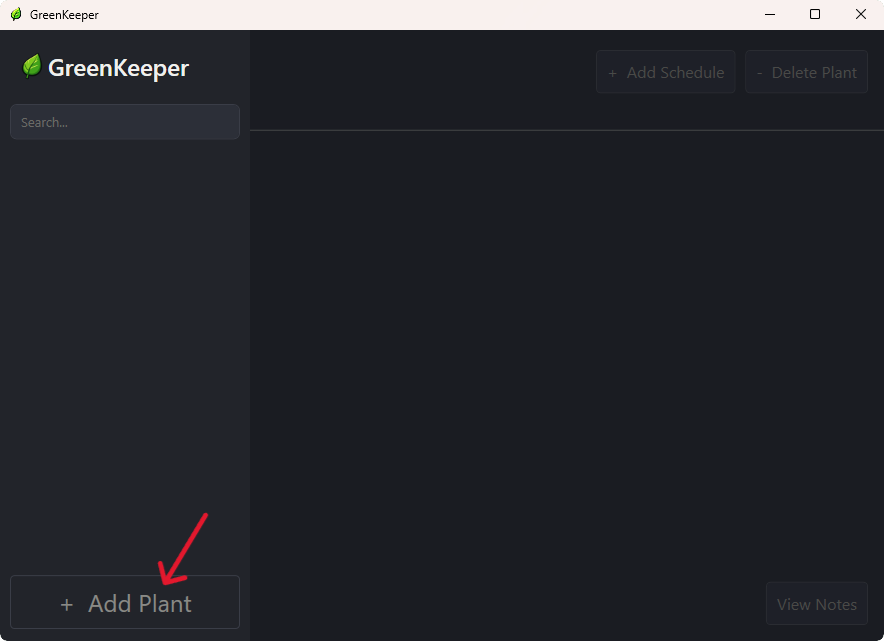
</p>

A short wizard will guide you through naming your plant and setting up its
care schedule, as shown below.

In the first step, you type in the name of your new plant. You have up to
**50 characters** available.

<p align="center">
  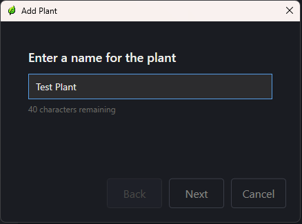
</p>

The next step is mandatory, which means you must enter a value to continue.
You enter the recurring period for watering.

<p align="center">
  
</p>

From a combobox, you can select any time unit you want for your recurring
period — e.g. setting 3 weeks means the next watering is due in 3 weeks.

<p align="center">
  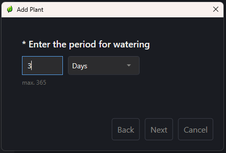
</p>

In the next step you can set the recurring period for fertilizing, which is an optional step, so you can skip it.
Entering invalid values will be considered as skip behvarior.

<p align="center">
  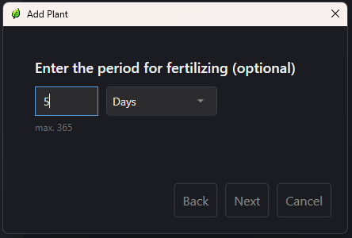
</p>

Just like in the previous step you have the option to select any time unit you want from a combobox.

<p align="center">
  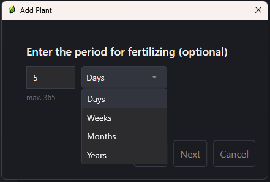
</p>

In the next step you can set the sunlight requirement, so you enter an amount of sun hours per time unit.
Just like the step for fertilizing, this step is optional and can be skipped if not needed.

<p align="center">
  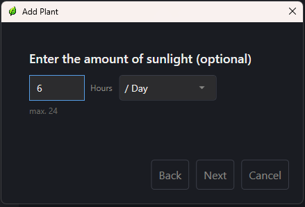
</p>

Just like the previous steps, you have the option to select any time unit you want from a combobox.

<p align="center">
  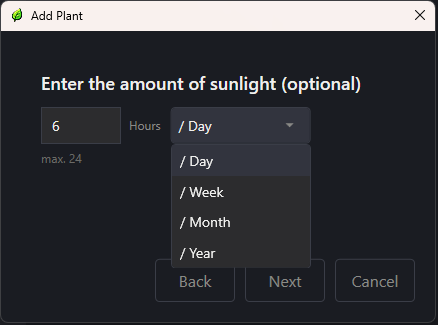
</p>

In the last step you get a summary of all your entered values. If you are good with everything, simply click **Finish**
and your new plant will be processed. If you have to correct any value you can always return to the previous steps.

<p align="center">
  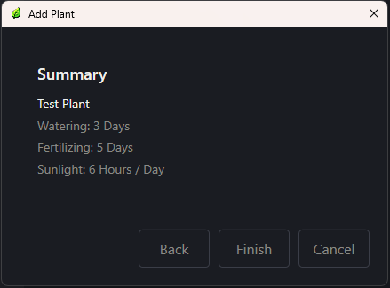
</p>

That's it. Your new plant is set. Click on the plant in the sidebar to see all set statuses.

<p align="center">
  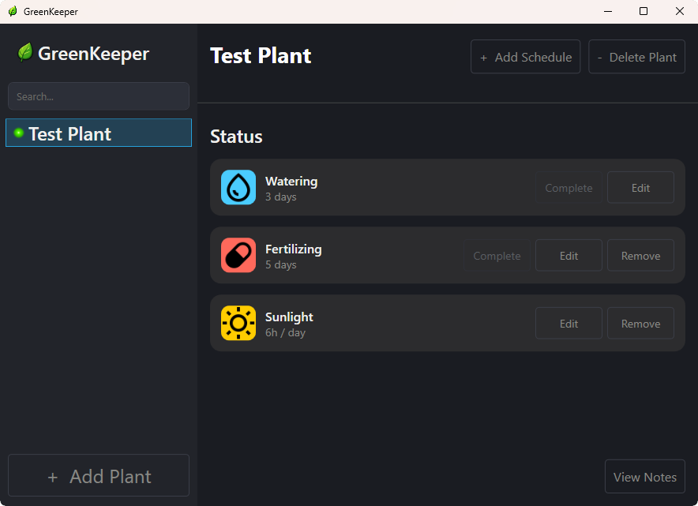
</p>

## Adding a Schedule

In case you want to add a schedule to the plant afterwards, you can add one single schedule to your plant
by clicking **+ Add Schedule** in the top right corner.

<p align="center">
  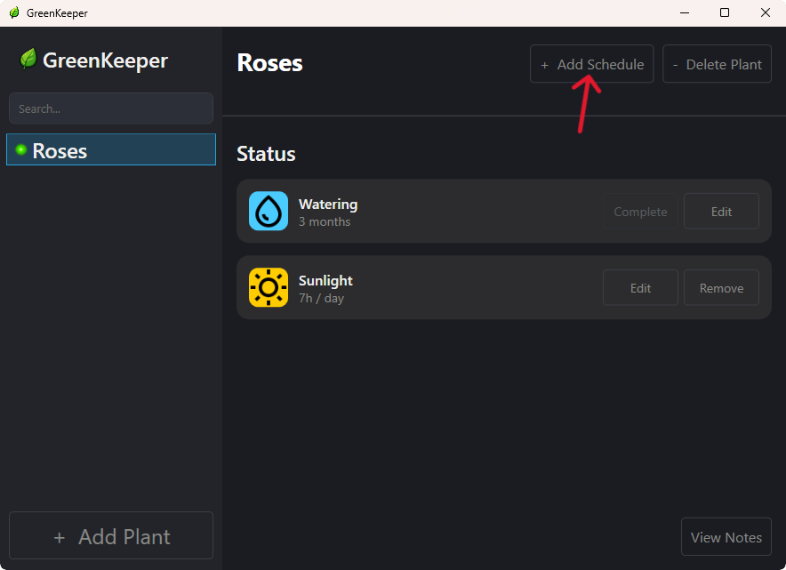
</p>

A short wizard will then guide you throught all steps to set the new schedule.

<p align="center">
  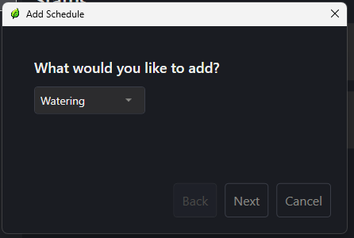
</p>

In the first step you choose the kind of schedule you want from a combobox
>[!NOTE]
> You can also set a schedule that already exists for your plant. In this case you will overwrite the previous one.

<p align="center">
  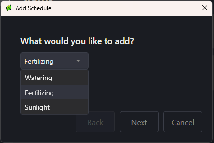
</p>

In the next step you enter a value for the period of the new schedule (similar to the step for the Add Plant option).

<p align="center">
  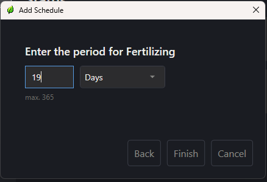
</p>

For the period, you can select any time unit you want.

<p align="center">
  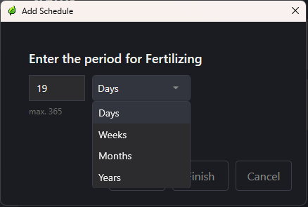
</p>

Once done, click **Finish** and the new schedule will be added to your plant.

<p align="center">
  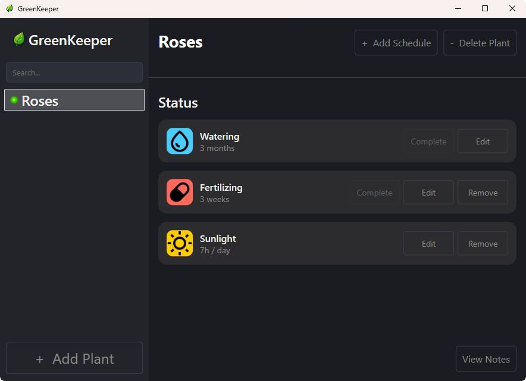
</p>

## Care Schedules

Care schedules are the heart of every plant — they're what actually keep
track of when your plants need attention. Every schedule falls into one
of two categories:

### Active Schedules
Have a concrete due date. They count down, can become overdue, and are marked as done.
You actively have to interact with them to keep the schedules up to date.

<p align="center">
  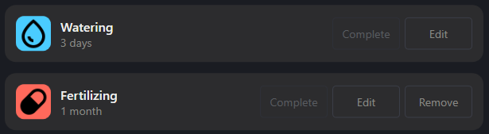
</p>

#### Handling Active Schedules

When you set a recurring period for an active care schedule, GreenKeeper
calculates the next due date and displays the remaining time in the most
fitting unit — days, weeks, months, or years. Each plant's overall state is
reflected by a colored dot next to its name in the sidebar, so you can see
what needs attention without opening anything.

**Upcoming** — as long as the due date lies in the future, the schedule
simply counts down and the plant is marked with a green dot. The
**Complete** button stays disabled, since there's nothing to do yet.

<p align="center">
  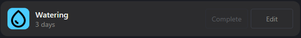
</p>

<p align="center">
  
</p>

**Due today** — on the day a schedule comes due, the status card shows
*Today* and the dot turns yellow. The **Complete** button is now enabled,
ready for you to mark the task as done.

<p align="center">
  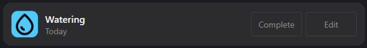
</p>

<p align="center">
  
</p>

**Overdue** — if the due date passes without the task being completed, the
schedule starts counting how long it's overdue and the dot turns red.

<p align="center">
  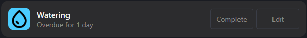
</p>

<p align="center">
  
</p>

#### Complete Option

Think of the **Complete** option as checking off a task: it tells
the application that you've just taken care of your plant, and the schedule
starts counting down again from that moment.

> [!NOTE]
> The Complete option stays disabled as long as the due date is still in
> the future. This prevents accidentally completing a task days before
> it's actually due.

As soon as a schedule comes due, **Complete** becomes available.

<p align="center">
  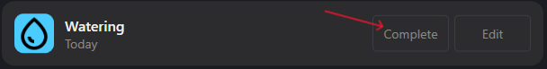
</p>

The same applies once a schedule is overdue — you can complete it at any
point afterwards, no matter how much time has passed.

<p align="center">
  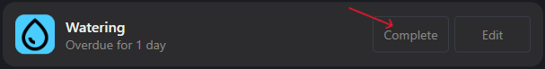
</p>

Once clicked, the schedule restarts immediately: the next due date is
calculated from the current moment, based on the period you configured —
not from the original due date.

<p align="center">
  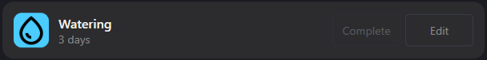
</p>

At the same time, the plant's dot in the sidebar returns to green,
regardless of whether it was yellow or red before.

<p align="center">
  
</p>

### Passive Care Schedules

Unlike active schedules, passive ones (currently only **Sunlight**) don't
have a due date and require no interaction at all. They simply record how
much of something a plant needs over a given period. There's no countdown running.
A passive schedule is purely information and a reminder of your plant's needs.

<p align="center">
  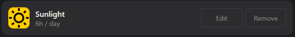
</p>

## Installation

You have two options to get GreenKeeper running:

- **[Download the prebuilt release](#download-the-prebuilt-release)**
- **[Clone and build from source](#clone-and-build-from-source)**

### Download the prebuilt release

#### Step 1: Download the latest release

Go to the [**Releases**](../../releases) page and download the ZIP file
for the latest version, e.g. `GreenKeeper-v1.0.0-win-x64.zip`.

> [!TIP]
> The asset is listed under **Assets** at the bottom of each release. Look
> for the file ending in `-win-x64.zip`.

#### Step 2: Extract the ZIP file

Right-click the downloaded ZIP file and select **Extract All...**, then
choose a folder of your choice (e.g. `C:\Programs\GreenKeeper`).

>[!NOTE]
>GreenKeeper doesn't need to be installed into `Program Files` - any
>folder works, as long as you keep the extracted files together in one place

#### Step 3: Run GreenKeeper

Open the extracted folder and double-click `GreenKeeper.exe`

>[!Warning]
>Since GreenKeeper isn't actually digitally signed, Windows SmartScreen may show a
>**"Windows protected your PC"** warning on first launch. This is expected
>for small, independently published applications - it does not mean the
>app to be unsafe.
>
>To proceed, click **More info**, then **Run anyway**.

That's it - no installer, no .NET Runtime to install separately. Everything
needed to run the app is already bundled in the download, so you are good to go!

#### System requirements

| Requirement | Details |
|---|---|
| Operating System | Windows 10 or later (64-bit) |
| Disk space | ~150 MB |
| .NET Runtime | Not required - bundled with the app |

#### Updating to a newer version

1. Download the new release ZIP as described above.
2. Extract it to a **new** folder (or overwrite the old files).
3. Delete the old version's files if you extracted to a new folder.

>[!NOTE]
>Your plant data is stored separately from the application files, in
>`%LocalAppData%\GreenKeeper`. Updating GreenKeeper - even to a different
>folder - never affects your existing data.

#### Uninstalling

Since GreenKeeper doesn't use a system installer, uninstalling is simple:

1. Delete the folder you extracted GreenKeeper into.
2. *(Optional)* To also remove your saved plant data, delete the folder `%LocalAppData%\GreenKeeper`.

---

### Clone and build from source

#### Prerequisites

| Requirement | Notes |
|---|---|
| [.NET 9 SDK](https://dotnet.microsoft.com/download/dotnet/9.0) | Required to build and run the project |
| [Git](https://git-scm.com/downloads) | To clone the repository |
| Windows 10 or later | GreenKeeper is Windows-only |
| Visual Studio 2022 (optional) | Recommended for the best development experience but not required |

#### Step 1: Clone the repository

```bash
git clone https://github.com/Nosgard/GreenKeeper.git
cd GreenKeeper
```

#### Step 2: Run it directly

```bash
dotnet run --project GreenKeeper
```

This builds and starts the app in one step - convenient while making
changes, but requires the .NET 9 SDK to remain installed on the machine.

#### Alternative approach: Build a standalone executable

To produce a self-contained `.exe` that doesn't require the .NET SDK to
run - the same way the official releases are built:

```bash
dotnet publish GreenKeeper -c Release -r win-x64 --self-contained true -p:PublishSingleFile=true -o publish
```

The resulting `GreenKeeper.exe` (plus a few native `.dll` files) will be in
the `publish` folder and can be run the same way as a downloaded release.

>[!NOTE]
>Building from source uses the exact same database setup as the prebuilt
>release: on first launch, GreenKeeper automatically creates its SQLite
>database at `%LocalAppData%\GreenKeeper`, no manual setup required.

#### Running the tests

GreenKeeper has a full Unit-Test suite covering the core logic. To run it:

```bash
dotnet test
```
